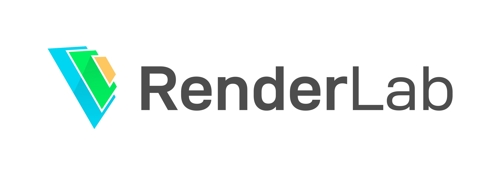

# RenderLab

<h1 align=center>

</h1>

## 0. 简介

渲染实验室，包含了实时渲染，离线渲染和场景编辑的功能

## 1. 特性

- 应用 App
  - 渲染实验室 RenderLab
  - 降噪器 Denoiser
  - 实时全局光照 RTGIwRRF
  - SObj 渲染器 SObjRenderer
  - SObj 采样器 SObjSampler
- 组件 Component
  - 相机 Camera
  - 变换 Transform
  - 材质 Material
    - 玻璃 Glass
    - 镜子 Mirror
    - 漫反射 Diffuse
    - 金属工作流 Metal Workflow
    - 毛玻璃 Frosted Glass
    - 寒霜 Frostbite
    - Gooch
  - 几何体 Geometry
    - 球 Sphere
    - 平面 Plane
    - 三角网格 TriMesh
    - 圆盘 Disk
    - 胶囊 Capsule
  - 光源 Light
    - 点光源 PointLight
    - 面光源 AreaLight
    - 方向光 DirectionalLight
    - 聚光灯 SpotLight
    - 无限远光源 InfiniteAreaLight
    - 球光源 SphereLight
    - 胶囊光源 CapsuleLight
    - 圆盘光源 DiskLight
- 离线渲染
  - 路径追踪 PathTracing
- 其他功能
  - [几何数学库 UGM](https://github.com/Ubpa/RenderLab/tree/master/include/CppUtil/Basic/UGM) 
  - AI 降噪 OptixAIDenoiser

## 2. 安装

CMake: 3.1.0 以上

Visual Studio: 2017

系统：windows 64位

Qt: 5.12.0 64位

CUDA: 9.0

Optix: 6.0

驱动：418.81 or later is required

安装方法见于 [setup.md](https://github.com/Ubpa/RenderLab/blob/master/setup.md) 

## 3. TODO

### Copy Frostbite

[MovingFrostbiteToPBR](https://github.com/Ubpa/Note/tree/master/CG/courses/MovingFrostbiteToPBR) 

- [x] 材质（HC-GGX + Disney Diffuse） 
  - [x] 离线
  - [x] 实时
- [ ] 光照
  - [x] 直接
    - [x] diffuse
      - [x] 点
      - [x] 聚光灯
      - [x] sphere
        - [x] 离线
        - [x] 实时
      - [x] disk
        - [x] 离线
        - [x] 实时
      - [x] rectangle / frustum
        - [x] 离线
        - [x] 实时
      - [x] tube / line
        - [x] 离线
          - [x] 形状
          - [x] 光源
        - [x] 实时
          - [x] 形状
          - [x] 光源
    - [x] specular
      - [x] Sphere
      - [x] disk
      - [x] rectangle / frustum
      - [x] tube / line
  - [ ] 间接
    - [x] distant light probe
    - [ ] local light probe
    - [ ] SSR
    - [ ] planar reflection
- [ ] 相机

### Impotant

- [x] 自己编写数学运算库，放弃 glm
- [x] 重构指针
- [x] 补充安装方法
- [x] 线性化 BVH
- [x] Imaging Pipline
- [x] 简单模型载入
- [x] 方向光
  - [x] 离线
  - [x] 实时
    - [x] 光照计算
    - [x] 阴影
  - [x] UI
  - [x] （反）序列化
- [x] 聚光灯
  - [x] 离线
  - [x] 实时
    - [x] 光照计算
    - [x] 阴影
  - [x] UI
  - [x] （反）序列化
- [x] 环境光

  - [x] 离线
    - [x] 别名法 AliasMethod
    - [x] 无限远光源 InifiniteAreaLight
  - [x] 实时
    - [x] 从 equirectangular map 到 cubemap
    - [x] 渲染 skybox
    - [x] irradiace map
    - [x] pre-filtering an HDR environment map
    - [x] pre-computing the BRDF
    - [x] IBL
      - [x] diffuse
      - [x] specular
  - [x] UI
  - [x] （反）序列化
- [x] 延迟管线（金属工作流）
  - [x] GBuffer
  - [x] Direct Light
  - [x] Ambient Light
  - [x] Sky Box
  - [x] window
  - [x] 优化
- [x] Gooch
- [ ] Frostbite
- [x] GLSL include
- [x] 光源与其他 Component 统一
- [ ] GLSL 库函数
- [ ] 重构 OpenGL 库（资源管理）
- [ ] 拷贝粘贴，模型、图像等复用
- [ ] CSM
- [ ] 封装 UBO，改进 FBO
- [ ] 解析 Shader（uniform）
- [ ] 实时渲染——面光源
- [ ] 旋转拖动缩放物体
- [ ] 重新架构 Raster
- [ ] 重构序列化
- [ ] Bloom

### Unimportant

- [ ] 添加注释
- [ ] 保存 Code 模式的 Trimesh
- [ ] 优化 intersector
- [ ] 清除 useless 参数

### Bugs

- [x] 边缘黑斑（大概是因为 ambient light 中直接写 directlight 的纹理导致的
- [ ] 切换 Raster 发生内存泄露
- [ ] 胶囊体的 uv
- [ ] 胶囊体光源离线有问题
- [x] disk 序列化

